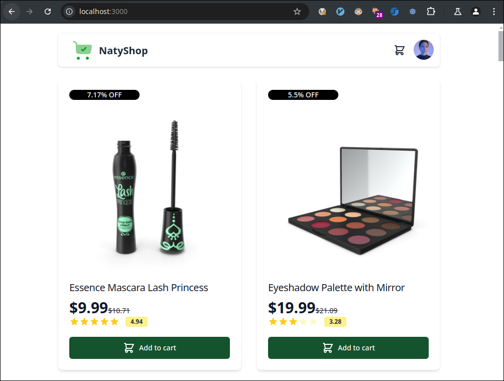
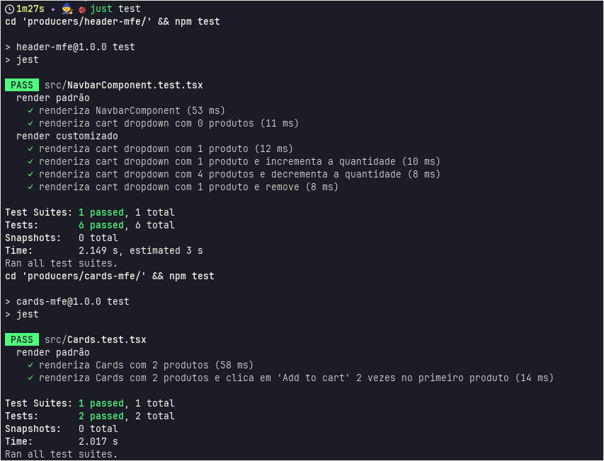

# Micro-Frontend (MFE) DEMO

### Descrição

Esse projeto é um micro-frontend usando [module federation 2.0](https://module-federation.io/) com 4 aplicações:

projeto | descrição 
------- | --------
header-mfe | 1ª aplicação producer, é o cabeçalho da aplicação tem o navbar com logo, botão para carrinho e perfil
cards-mfe | 2ª aplicação producer, onde os produtos são listados em cards
footer-mfe | 3ª aplicação producer, onde estão links sobre o site (apenas mocks)
**shell** | aplicação consumer, é o invólucro que carrega as 3 aplicações producer

Esse projeto utiliza o bundler [`rsbuild`](https://rsbuild.dev/) ao invés do `webpack`, é projeto recomendado pela module-federation.io, faz parte de um conjunto ferramental escrito em `rust` com alta performance.

A comunicação entre as aplicação, foi feita utilizado a abordagem de `EventTarget` e `CustomEvent`, uma aplicação produz informação por meio de eventos *dispatch* e outra aplicação escuta *subscribe* a esses eventos.

Exemplo quando o usuário clica no botão `Add to cart` na aplicação `cards-mfe`, envia o evento via `dispatch`

```ts
// producers/cards-mfe/src/Card.tsx
const sendEvent = (e: Product) => {
  (window as any).eventBus.dispatch('ADD_PRODUCT_CART', e);
};
```

E a aplicação `header-mfe` uma função "ouve" os eventos `subscribe` para então adicionar o produto ao carrinho.
```ts
// producers/header-mfe/src/NavbarComponent.tsx
  useEffect(() => {
    (window as any).eventBus.subscribe('ADD_PRODUCT_CART', handleCardSelected);
    return () => {
      (window as any).eventBus.unsubscribe(
        'ADD_PRODUCT_CART',
        handleCardSelected,
      );
    };
  }, []);
```


### Dependências

Para executar o projeto as seguintes dependências precisam estar instaladas.

- node 20 (ou maior)
- npm 10 (ou maior)

### Dependências opcionais

 - [just](https://github.com/casey/just)
 - [docker](https://github.com/docker)


### Executando o projeto

#### com dependências opcionais 

A forma mais simples de executar o projeto é com [docker](#dependências-opcionais)

```sh
docker compose up
```
#### sem as dependências opcionais

Você precisará de 4 terminais abertos, um para cada micro-frontend

```bash
# 1º terminal
cd producers/header-mfe/
npm install
npm start

# 2º terminal
cd producers/cards-mfe/
npm install
npm start

# 3º terminal
cd producers/footer-mfe/
npm install
npm start

# 4º terminal (shell app)
cd shell
npm install
npm start
```

Acesso pelo seu navegador no endereço:

    http://localhost:3000

**Screenshot página:**



### Executando os testes
#### com dependências opcionais 

```sh
just test
```
**Screenshot dos testes**



### sem as dependências opcionais

```bash
cd producers/header-mfe/
npm test

# 2º terminal
cd producers/cards-mfe/
npm test
```
